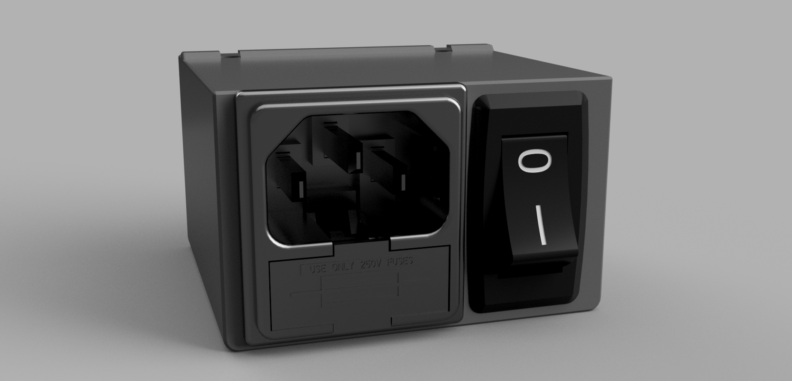

# Power inled mod for Voron V0.1

Modded power inlet modified to accomodate the following AC connector and rocker switch :

 - Bulgin PF0011/15/63 (RS ref. [481-639](https://fr.rs-online.com/web/p/connecteurs-iec/0481639/))
 - Wurth 471005264152 (RS ref. [185-4344](https://fr.rs-online.com/web/p/interrupteurs-a-bascule/1854344/))

*I changed the original reference because it was out of stock on many suppliers.*

